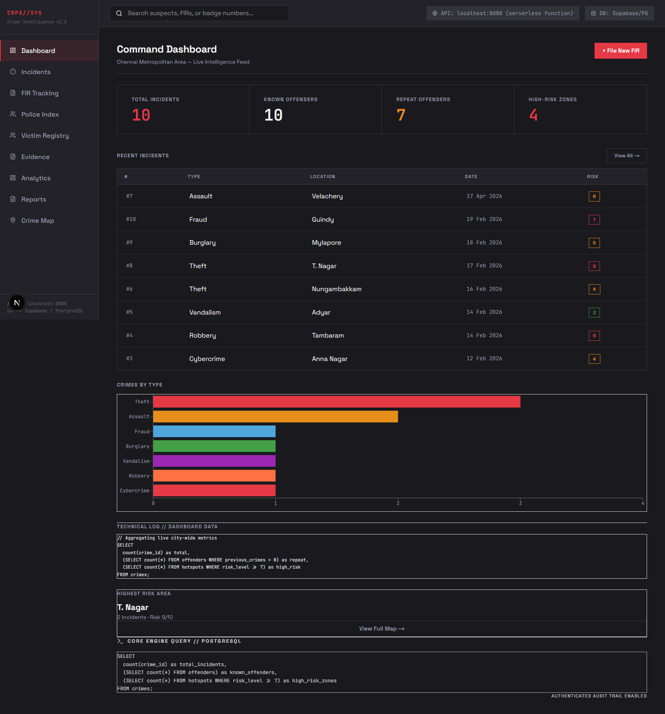
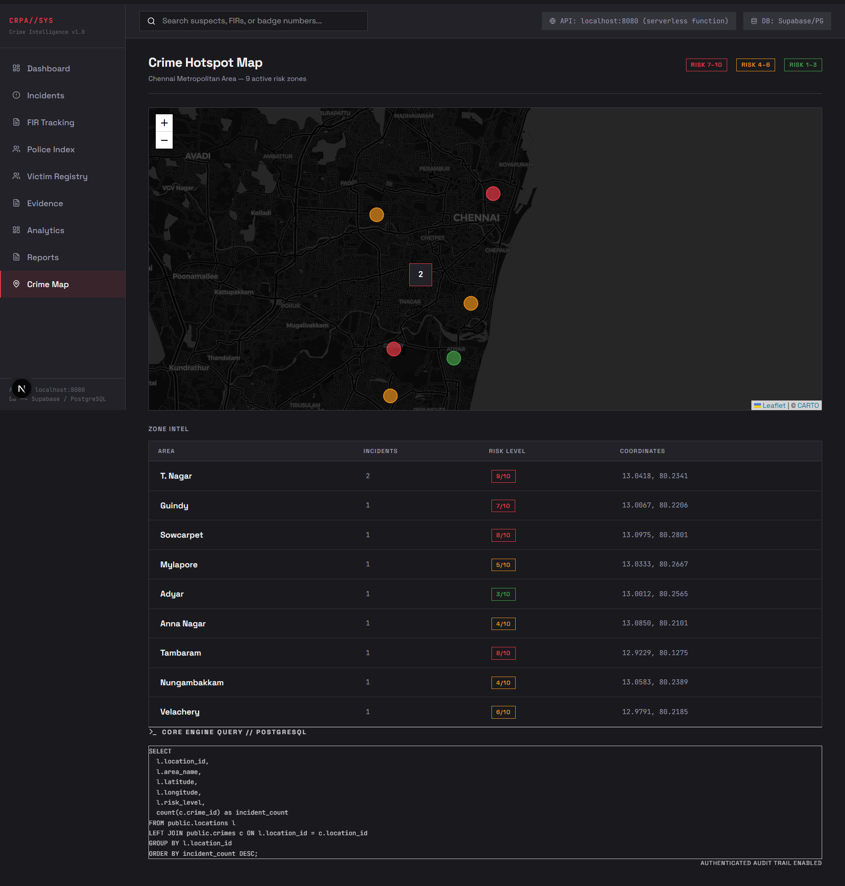
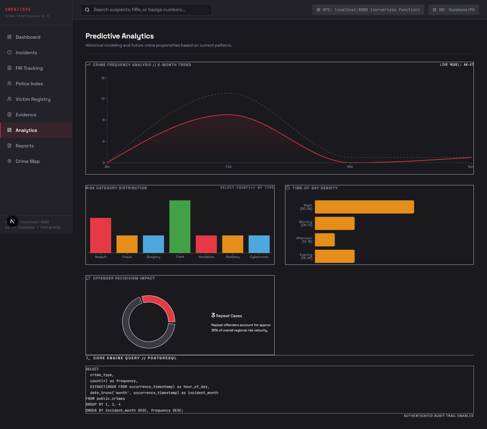
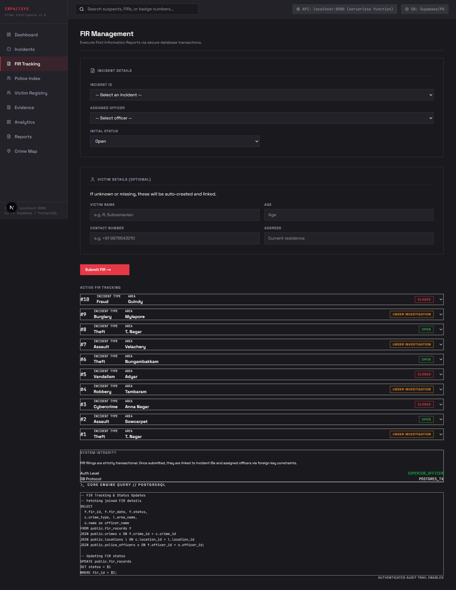

# Crime Record and Pattern Analysis (CRPA)

<details open>
  <summary><b>Dashboard Intelligence</b></summary>
  <br>
  
</details>

<details>
  <summary><b>Geospatial Hotspot Matrix</b></summary>
  <br>
  
</details>

<details>
  <summary><b>Analytics</b></summary>
  <br>
  
</details>

<details>
  <summary><b>FIR Lifecycle Tracking</b></summary>
  <br>
  
</details>

## Overview

A full-stack crime intelligence system for law enforcement. Officers can track incidents, profile offenders, view crime hotspots on a live map, and file First Information Reports — all backed by a PostgreSQL database on Supabase.

---

## Tech Stack

| Layer    | Technology                          |
|----------|-------------------------------------|
| Database | PostgreSQL (Supabase)               |
| Backend  | Go 1.25 · chi router · pgx/v5       |
| Frontend | Next.js 16 · TypeScript · Tailwind  |
| Map      | React-Leaflet (CartoDB dark tiles)  |
| Charts   | Recharts                            |

---

## Project Structure

```
Crime-Record-Analysis/
├── api/              # Go backend
│   ├── cmd/main.go           # Entry point, route registration
│   ├── internal/
│   │   ├── database/db.go    # Supabase connection via pgx
│   │   ├── handlers/         # One file per endpoint
│   │   └── models/models.go  # Shared struct definitions
│   ├── .env.example          # Copy to .env and fill in DATABASE_URL
│   └── go.mod
├── frontend/         # Next.js app
│   ├── app/
│   │   ├── components/Sidebar.tsx
│   │   ├── crimes/page.tsx
│   │   ├── offenders/page.tsx
│   │   ├── map/page.tsx + MapView.tsx
│   │   ├── fir/page.tsx
│   │   └── page.tsx          # Dashboard
│   └── lib/api.ts            # Centralised Go API client
└── db/
    ├── new.sql                # DDL — CREATE TABLE statements
    └── insert.sql             # Seed data (10 Chennai locations + crimes)
```

---

## Setup

### 1. Database

Run `db/new.sql` then `db/insert.sql` in the Supabase SQL Editor.

### 2. Backend

```bash
cd api
cp .env.example .env        # Add your Supabase DATABASE_URL
go run ./cmd/main.go        # Starts on http://localhost:8080
```

### 3. Frontend

```bash
cd frontend
npm install
npm run dev                 # Starts on http://localhost:3000
```

---

## API Routes

| Method | Route            | Description                                      |
|--------|------------------|--------------------------------------------------|
| GET    | `/health`        | Server health check                              |
| GET    | `/api/locations` | All tracked locations with lat/long + risk level |
| GET    | `/api/crimes`    | All incidents, joined with location. `?type=` filter supported |
| GET    | `/api/offenders` | All offenders ordered by repeat-crime count      |
| GET    | `/api/hotspots`  | Crime counts grouped by location (for map)       |
| GET    | `/api/fir`       | Fetch all filed FIRs with joined details         |
| POST   | `/api/fir`       | File a new FIR (runs a DB transaction)           |
| PUT    | `/api/fir/{id}`  | Update FIR investigation status                  |
| GET    | `/api/audit`     | View system-wide audit trail                     |

### POST /api/fir — Request Body

```json
{
  "crime_id":   1,
  "officer_id": 3,
  "status":     "Open",
  "victim_name":    "R. Subramanian",
  "victim_age":     45,
  "victim_contact": "+91 9876543210",
  "victim_address": "Chennai, Tamil Nadu"
}
```

`status` must be one of: `"Open"`, `"Closed"`, `"Under Investigation"`.

---

## Technical Accountability (Audit Trail)

The system automatically logs critical actions to ensure transparency and integrity:
- **CREATE_FIR**: Logged when a new report is filed, including the officer's name and linked incident.
- **IDENTIFY_OFFENDER**: Logged when an offender is linked to a crime.
- **EVIDENCE_LOGGED**: Logged when new evidence is registered.
